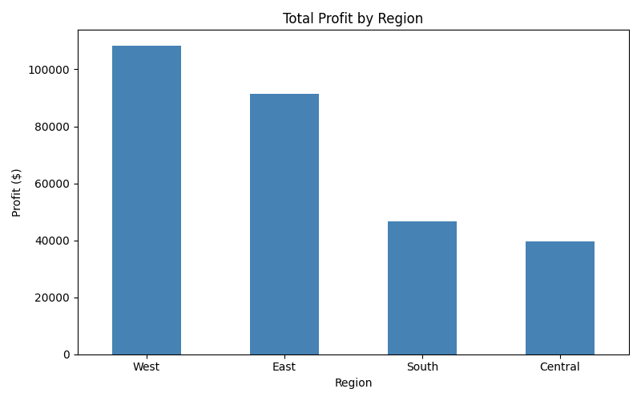
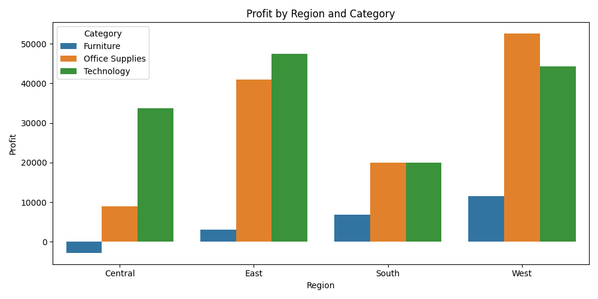
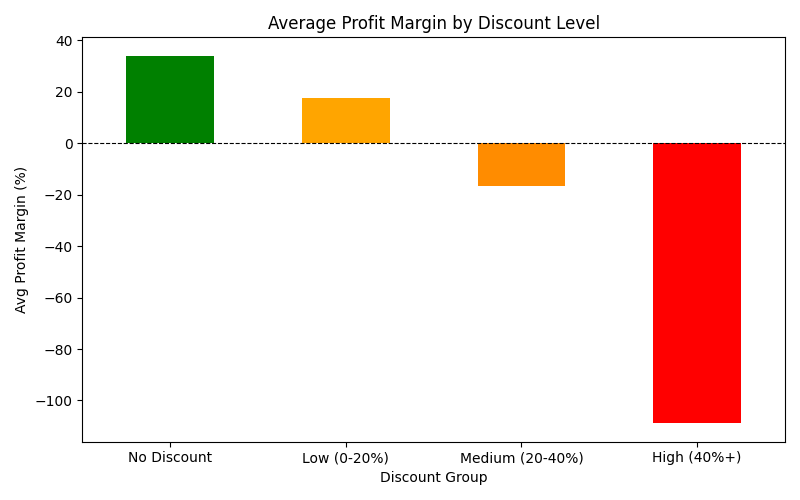
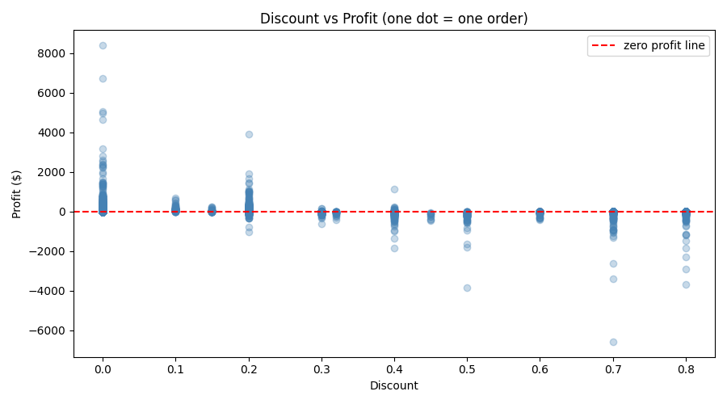
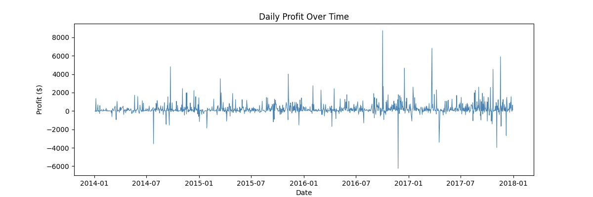
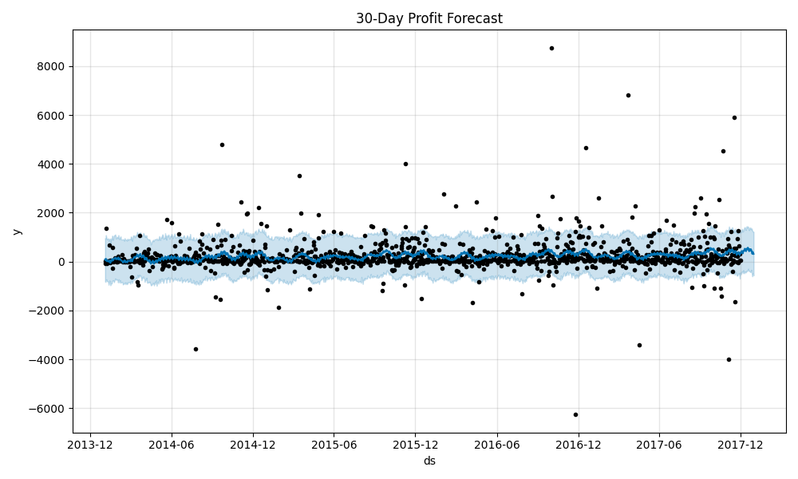
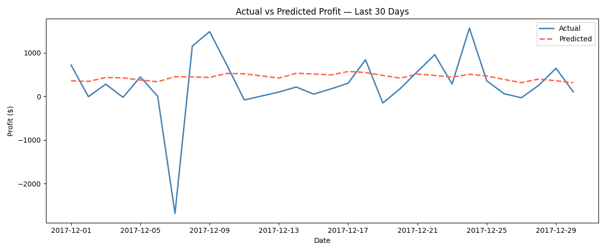

# ProfitLens — Retail Analytics & 30-Day Profit Forecasting

A Python data analysis project built on 9,994 real e-commerce transactions (2014–2018).
The goal was to uncover what's actually driving profit and loss in a retail business — especially over sale days.
and then use that to forecast the next 30 days of profit.

---

## Key Findings

- Orders with **no discount** had an average profit margin of **+34%**
- Orders with **40%+ discount** had an average profit margin of **-108%** — the business was actively losing money on these
- The **West region** was the most profitable; **Central** was the weakest
- **Technology** was the highest-margin category across all regions; **Furniture** often ran at a loss
- Prophet's 30-day forecast captured the overall profit trend with a daily MAE of **$464**

---

## What This Project Does

| Step | Analysis | Output |
|------|----------|--------|
| 1 | Load & inspect the dataset | Shape, column types, date range |
| 2 | Clean the data | Drop irrelevant columns, fix date format, remove duplicates |
| 3 | Regional profitability | Which regions and categories generate the most profit? |
| 4 | Discount impact on margins | How aggressively do discounts erode profit? |
| 5 | 30-day profit forecast | Time-series forecast using Facebook Prophet |

---

## Charts Generated

**Profit by Region**


**Profit by Region and Category**


**Discount Impact on Profit Margins**


**Discount vs Profit — Scatter (one dot = one order)**


**Daily Profit Over Time**


**30-Day Forecast**


**Actual vs Predicted — Last 30 Days**


---

## Prophet for Forecasting.

Prophet is an open-source forecasting library built by Meta's data science team.
It is designed specifically for business time-series data — it automatically detects
weekly and yearly seasonal patterns without requiring manual feature engineering.

Given that retail profit has clear seasonal behaviour (holiday spikes, monthly cycles),
Prophet was a more appropriate choice here than a general regression model like XGBoost,
which would require manually creating lag features to understand time patterns.

---


## Dataset

**Superstore Sales** — [kaggle.com/datasets/vivek468/superstore-dataset-final](https://www.kaggle.com/datasets/vivek468/superstore-dataset-final)

- 9,994 transactions across 4 US regions
- Date range: January 2014 – December 2017
- Columns used: Order Date, Region, Category, Sales, Profit, Discount, Quantity, Segment

Columns dropped during cleaning (identifiers with no analytical value):
`Row ID`, `Order ID`, `Customer ID`, `Customer Name`, `Country` (all rows = USA), `City`, `Product ID`, `Product Name`

---


## How to Run

**1. Clone the repo and set up the data folder**
```bash
git clone https://github.com/aaliyaagupta/ProfitLens.git
cd ProfitLens
```
Download `Sample - Superstore.csv` from Kaggle and place it in the `data/` folder.

**2. Install dependencies**
```bash
pip install pandas numpy matplotlib seaborn prophet scikit-learn jupyter
```

**3. Open the notebook**
```bash
jupyter notebook notebooks/profitlens.ipynb
```

**4. Run all cells**

`Kernel → Restart & Run All`

Charts will be saved automatically to the `outputs/` folder.

---

## Libraries Used

| Library | Purpose |
|---------|---------|
| pandas | Data loading, cleaning, grouping |
| numpy | Margin calculations |
| matplotlib | Charts and plots |
| seaborn | Grouped bar charts |
| prophet | 30-day time-series forecasting |
| scikit-learn | MAE and RMSE evaluation |

---
